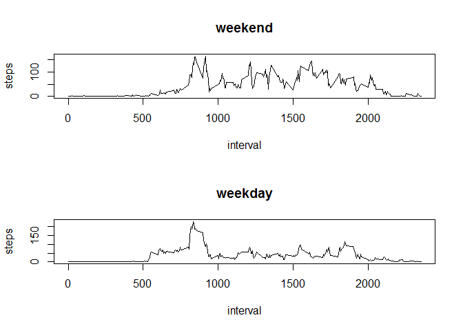

# Reproducible Research: Peer Assessment 1
neopanda  
Sunday, November 16, 2014  

##Introduction

It is now possible to collect a large amount of data about personal movement using activity monitoring devices such as a Fitbit, Nike Fuelband, or Jawbone Up. These type of devices are part of the "quantified self" movement - a group of enthusiasts who take measurements about themselves regularly to improve their health, to find patterns in their behavior, or because they are tech geeks. But these data remain under-utilized both because the raw data are hard to obtain and there is a lack of statistical methods and software for processing and interpreting the data.

This assignment makes use of data from a personal activity monitoring device. This device collects data at 5 minute intervals through out the day. The data consists of two months of data from an anonymous individual collected during the months of October and November, 2012 and include the number of steps taken in 5 minute intervals each day.


##Loading and preprocessing the data

Show any code that is needed to

* Load the data (i.e. read.csv())


```r
# Load data
activity <- read.csv("activity.csv")
```

* Process/transform the data (if necessary) into a format suitable for your analysis


```r
# Change classes
activity$date <- as.Date(activity$date, format="%Y-%m-%d")
activity$steps <- as.numeric(activity$steps)
activity$interval <- as.numeric(activity$interval)
```


##What is mean total number of steps taken per day?

For this part of the assignment, you can ignore the missing values in the dataset.

* Make a histogram of the total number of steps taken each day


```r
# Histogram of the total number of steps taken each day
stepsPerDate <- aggregate(steps ~ date, data = activity, FUN = sum)
barplot(stepsPerDate$steps, names.arg = stepsPerDate$date, xlab = "Days", ylab = "Number of steps")
```

 

* Calculate and report the mean and median total number of steps taken per day


```r
# Mean
mean(stepsPerDate$steps)
```

```
## [1] 10766.19
```


```r
# Median
median(stepsPerDate$steps)
```

```
## [1] 10765
```


##What is the average daily activity pattern?

* Make a time series plot (i.e. type = "l") of the 5-minute interval (x-axis) and the average number of steps taken, averaged across all days (y-axis)


```r
# Plot average number of steps taken per 5-minute interval
stepsPerInterval <- aggregate(steps ~ interval, data = activity, FUN = mean)
plot(stepsPerInterval, type = "l")
```

 

* Which 5-minute interval, on average across all the days in the dataset, contains the maximum number of steps?


```r
# Interval containing the maximum number of steps
stepsPerInterval$interval[which.max(stepsPerInterval$steps)]
```

```
## [1] 835
```


##Imputing missing values

Note that there are a number of days/intervals where there are missing values (coded as NA). The presence of missing days may introduce bias into some calculations or summaries of the data.

* Calculate and report the total number of missing values in the dataset (i.e. the total number of rows with NAs)


```r
# Counting the total number of missing values
sum(is.na(activity))
```

```
## [1] 2304
```

* Devise a strategy for filling in all of the missing values in the dataset. The strategy does not need to be sophisticated. For example, you could use the mean/median for that day, or the mean for that 5-minute interval, etc.

Replace NA values with the mean for that 5-minute interval.

* Create a new dataset that is equal to the original dataset but with the missing data filled in


```r
# New dataset
activity_without_NA <- activity
activity_without_NA$steps <- mapply(
    function(steps, interval)
        if (is.na(steps))
            stepsPerInterval[stepsPerInterval$interval == interval, 2]
        else
            steps, activity_without_NA$steps, activity_without_NA$interval
)

# Checking
summary(activity_without_NA)
```

```
##      steps             date               interval     
##  Min.   :  0.00   Min.   :2012-10-01   Min.   :   0.0  
##  1st Qu.:  0.00   1st Qu.:2012-10-16   1st Qu.: 588.8  
##  Median :  0.00   Median :2012-10-31   Median :1177.5  
##  Mean   : 37.38   Mean   :2012-10-31   Mean   :1177.5  
##  3rd Qu.: 27.00   3rd Qu.:2012-11-15   3rd Qu.:1766.2  
##  Max.   :806.00   Max.   :2012-11-30   Max.   :2355.0
```

* Make a histogram of the total number of steps taken each day and Calculate and report the mean and median total number of steps taken per day. Do these values differ from the estimates from the first part of the assignment? What is the impact of imputing missing data on the estimates of the total daily number of steps?


```r
# Histogram of the total number of steps taken each day
stepsPerDate_without_NA <- aggregate(steps ~ date, data = activity_without_NA, FUN = sum)
barplot(stepsPerDate_without_NA$steps, names.arg = stepsPerDate_without_NA$date, xlab = "Days", ylab = "Number of steps")
```

 


```r
# Mean
mean(stepsPerDate_without_NA$steps)
```

```
## [1] 10766.19
```


```r
# Median
median(stepsPerDate_without_NA$steps)
```

```
## [1] 10766.19
```

####Answer :
There is no real difference between the mean and the median after imputing missing data.


##Are there differences in activity patterns between weekdays and weekends?

For this part the weekdays() function may be of some help here. Use the dataset with the filled-in missing values for this part.

* Create a new factor variable in the dataset with two levels - "weekday" and "weekend" indicating whether a given date is a weekday or weekend day.


```r
# Create a new factor
dayType <- function(date) {
    if (weekdays(as.Date(date)) %in% c("Saturday", "Sunday", "samedi", "dimanche")) {
        "weekend"
    } else {
        "weekday"
    }
}
activity_without_NA$daytype <- as.factor(sapply(activity_without_NA$date, dayType))
```

* Make a panel plot containing a time series plot (i.e. type = "l") of the 5-minute interval (x-axis) and the average number of steps taken, averaged across all weekday days or weekend days (y-axis). See the README file in the GitHub repository to see an example of what this plot should look like using simulated data.


```r
# Panel plot
par(mfrow = c(2, 1))

# Plot for weekday and weekend
for (type in c("weekend", "weekday")) {
    stepsPerDaytime <- aggregate(steps ~ interval, data = activity_without_NA, subset = activity_without_NA$daytype == type, FUN = mean)
    plot(stepsPerDaytime, type = "l", main = type)
}
```

 
